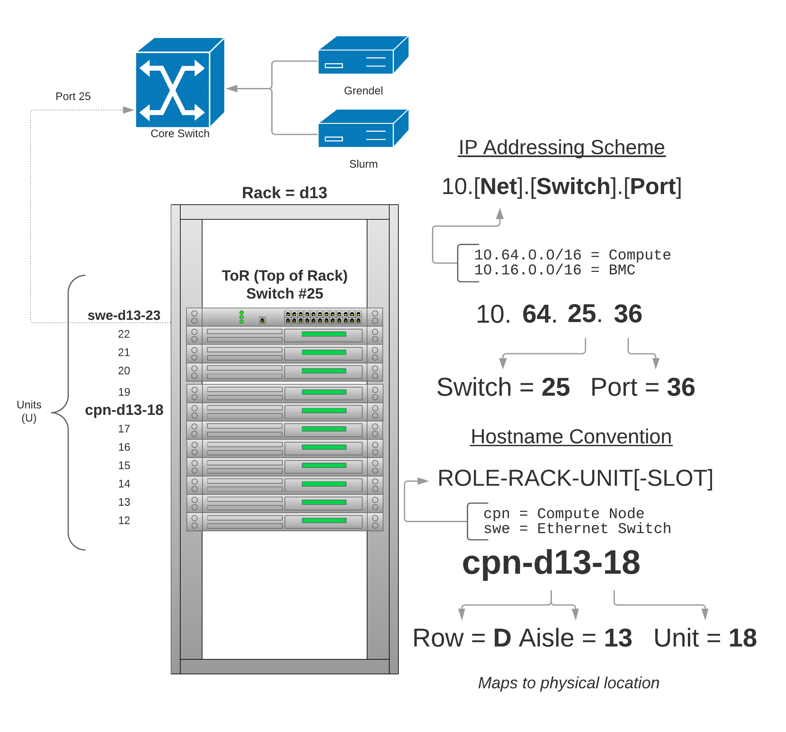

# Background

This document provides a basic overview of building an HPC cluster. To help
frame the discussion and provide a bit of context, let's suppose you've just
secured the funds to purchase a Linux based HPC cluster and the physical
components are sitting on your data center floor. Researchers are now eager to
run their computations and your job is to get the cluster up and running. The
following sections will describe a basic architecture for building out a
cluster, the various technologies involved, and how Grendel can be leveraged to
streamline the process. We'll show some simple uses cases for deploying Grendel
and describe the services it provides. This introduction does not attempt to be
a comprehensive guide to installing an HPC cluster and basic knowledge of HPC,
Linux, and networking is assumed. 

## Basic Network Architecture

There are many architectures for building a HPC cluster and for the purposes of
this introduction we'll be using a "Top-of-rack (ToR) switching" network
architecture design. In this type of design compute nodes, switches, PDU's, and
other components are located within the same (or adjacent rack) and are
connected to an in-rack network switch commonly located at the top/middle of
the rack. The in-rack network switch is then connected to a core aggregation
switch or switches that connect the rest of the data center. After all the
physical components are racked, cabled and powered on the individual compute
nodes need an operating system installed and configured. To achieve this
we'll need some basic information about each compute node such as:

- Host naming convention to assign hostnames
- IP Addressing scheme to assign an IP address to each node
- MAC Address of the networking interface

### Host Naming Scheme 

The host name scheme uses the compute nodes physical location within the data
center to better help the system administrators service the nodes. The host
naming convention is as follows:

!!! note "Hostname Convention"
    ROLE-RACK-UNIT[-SLOT]

Each component (server, switch, PDU, etc) is named according to their role:

- cpn - compute node
- swe - ethernet switch
- swi - Infiniband switch
- pdu - Power distribution unit

Followed by the physical rack in which they are located. Rack's are named based
on their location (row/aisle) in the data center. For example, rack `d13` is
located in row `D` aisle `13`. The last component of the name is the unit
within the rack followed by an optional "slot". The slot is for compute node
chassis that have more than one node within the same rack unit. For example,
the dell C6420's are 2U servers with 4 compute nodes (2 in each rack unit).
These compute nodes would get names like:

- cpn-d13-18-02
- cpn-d13-18-01
- cpn-d13-19-01
- cpn-d13-19-02

### IP Addressing Scheme

To assign IP addresses to each compute node the following scheme is used:

!!! note "IP Addressing Scheme"
    10.[Net].[Switch].[Port]

Class B subnets are created for each high level grouping of services. As a
simple example, suppose the following 3 networks:

- `10.64.0.0/16`  - HPC compute nodes
- `10.16.0.0/16`  - BMC management network
- `10.32.0.0/16`  - Core services

All compute servers will live on `10.64.0.0/16`, a management network
`10.16.0.0/16` is created for the BMC devices for out of band management of the
nodes, and `10.32.0.0/16` will be used for core services like DHCP, DNS, LDAP,
etc.

Each ToR switch will have a number, this could be for example based on the port
it's plugged into on the core switch. For example, the ToR switch in rack `d13`
is plugged into port `25` on the core switch so we'll number this `25`. Each
switch will have it's own VLANID and subnet for each network. Continuing with
our example, for the compute network switch number 25 will have VLANID `1025`
and subnet `10.64.25.0/24`. For the BMC network, switch number 25 will have
VLANDI `3025` and subnet `10.16.25.0/24` and so on. 

Each node in rack `d13` will be assigned an IP address based on the port it's
plugged into on the ToR switch. As a complete working example, the compute node
physically located in rack d13 unit 18 plugged into port 36 on ToR switch 25
would have IP address `10.64.25.36`.

### Overview

The diagram below shows a typical ToR architecture and the basic IP and host name
addressing scheme described in the sections above:



## Auto-Discovery of Hosts

Depending on how the BIOS are configured from the factory, after the compute
nodes are powered on for the very first time they will typically attempt to a
network boot via PXE. The ToR switches are typically configured to relay DHCP
packets to one or more DHCP servers in the data center. Here we configure all
ToR switches to relay DHCP requests to our Grendel server. Grendel can now be
used to harvest the MAC addresses of each compute node using one of the host
auto-discovery methods. After the hosts are loaded into Grendel they can be
provisioned.

### Discover hosts using switch

Assuming we're using the IP addressing scheme described in the previous section
we can interrogate the ToR switch MAC address table to auto-discover hosts and
load them into Grendel. This works by using either SNMP or the RedFish API on
the switch to obtain the MAC address table listing out the MAC address, port
number, and VLANID. We can then provide Grendel a simple text file of hostname
to port mapping to automatically load hosts into Grendel.

```
$ grendel discover switch --endpoint swe-d13-25 --mapping hosts.txt --subnet 10.64.0.0
```

### Discover hosts using DHCP

If we're not concerned with mapping host names to physical locations or don't
have a particular IP addressing scheme we can use DHCP to auto-discover hosts
and load them into Grendel. Here we assume we have a rack of hosts continuously
sending out DHCP boot requests. The goal here is to capture the MAC addresses
of the requests and assign them a hostname and IP address in a contiguous
manner. We can run Grendel with the following command providing a subnet and a
nodeset for assigning host names:

```
$ grendel discover dhcp --subnet 10.64.0.0 --nodeset tux-[01-100]
```

### Discover hosts using a file

If you have an existing DHCP server you can load hosts into Grendel using a
`dhcpd.leases` file. An example `dhcpd.leases` file looks like this:

```
TODO
```

### Discover hosts using a file

Grendel also supports loading hosts via a simple text file. You can use this
method if you have obtained the host names, IP, and MAC addresses via other
means and simply want to load these into Grendel.

```
$ grendel discover file --input hosts.txt
```

## Network OS Install
