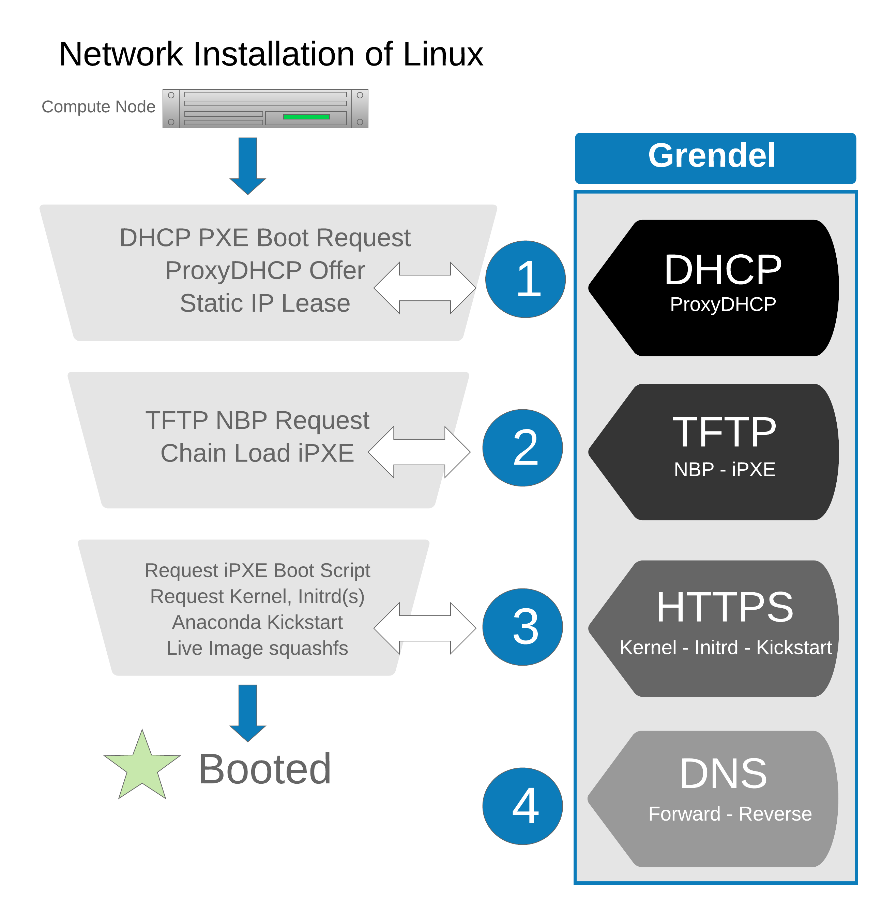

# Introduction

Grendel is a bare metal provisioning system specifically tailored to High
Performance Computing (HPC) Linux clusters. Grendel aims to be a lightweight
alternative to xCAT, Warewulf, and Foreman.

Grendel provides an implementation of network protocols required to provision
Linux systems over a network in a single binary:

1. DHCP - Static leases and ProxyDHP (PXE) server
2. TFTP - Used to chain load iPXE open source network boot firmware
3. HTTPS - Serve iPXE boot scripts, kernel/initrd, Kickstart and Live images
4. DNS - Forward and reverse name resolution for compute nodes

Grendel also provides a CLI and rest API for managing hosts and OS images. A
high-level overview of installing Linux over the network using Grendel is shown
below:

Grendel can be deployed in several different ways depending on your level of
commitment. You can enable/disable any combination of the above network
services depending on your existing setup. For example, if you already have an
existing DHCP server, Grendel can run a ProxyDHCP server only and will serve
PXE boot requests but not provide any static leases. Used in combination with
the HTTP server, Grendel can serve up the provision assets such as iPXE boot
script, kernels, initrds, and anaconda kickstart files.

